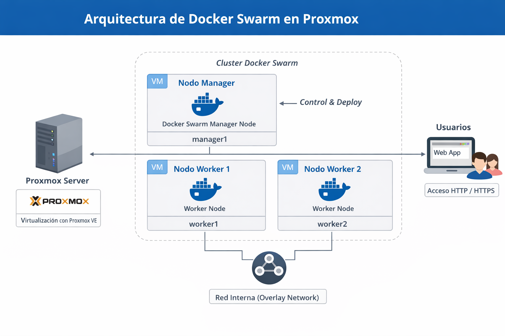

# 🐳 Docker Swarm en Proxmox VE

## 📖 Descripción General

This project demonstrates how to deploy and manage a Docker Swarm cluster using virtual machines hosted on Proxmox VE. The lab simulates a small production-like environment for learning container orchestration, clustering, and high availability concepts.

---

## 🧱 Arquitectura

* 1x Proxmox VE Host
* 1x Docker Swarm Manager VM
* 2x Docker Swarm Worker VMs
* Ubuntu Server 22.04 LTS
* Bridged Network (vmbr0)


---

## ⚙️ Requisitos

* Proxmox VE 7 or later
* Ubuntu template with Cloud-Init (recommended)
* Minimum per VM:

  * 2 vCPU
  * 2GB RAM
  * 20GB Disk
* Network bridge configured

---

## 🚀 Paso 1: Instalar Docker en Todos los Nodos

```bash
sudo apt update
sudo apt install -y docker.io
sudo systemctl enable docker
sudo systemctl start docker
```

Verify installation:

```bash
docker --version
```

---

## 🧠 Paso 2: Inicializar Docker Swarm (Solo Manager)

On **manager01**:

```bash
docker swarm init --advertise-addr <MANAGER_IP>
```

This command outputs a join token.

---

## 👷 Paso 3: Unir los Nodos Worker

On worker nodes, run:

```bash
docker swarm join --token <TOKEN> <MANAGER_IP>:2377
```

Verify cluster status from manager:

```bash
docker node ls
```

---

## 🌐 Paso 4: Desplegar un Servicio de Prueba

Create an NGINX service with replicas:

```bash
docker service create \
  --name webapp \
  --replicas 3 \
  -p 8080:80 \
  nginx
```

Check service:

```bash
docker service ls
docker service ps webapp
```

Access from browser:

```
http://<ANY_NODE_IP>:8080
```

---

## 📈 Escalar el Servicio

```bash
docker service scale webapp=5
```

---

## 🔄 Actualizaciones Graduales (Rolling Updates)

```bash
docker service update --image nginx:alpine webapp
```

---

## 📦 Desplegar un Stack (Archivo Compose)

Create `docker-compose.yml`:

```yaml
version: "3.8"
services:
  app:
    image: nginx
    ports:
      - "8081:80"
    deploy:
      replicas: 2
```

Deploy stack:

```bash
docker stack deploy -c docker-compose.yml mystack
```
## 🧑‍💻 Autor

Jonas Carrillo Carballo

Cloud & Infrastructure Engineer

---

💡 This lab is ideal for DevOps practice, interview preparation, and infrastructure experimentation.
